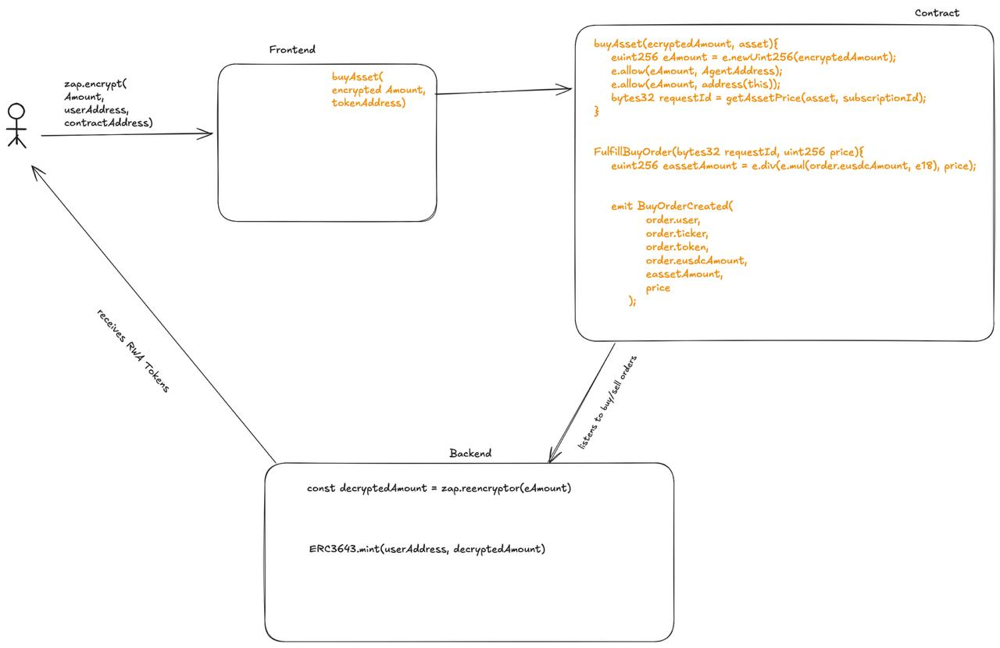

# Spout Finance  — Confidential RWA Collateral Protocol
Spout Finance revolutionizes DeFi by introducing secure, yield-bearing collateral options backed by real-world assets. It enables institutions to transact and earn yield while maintaining full confidentiality through encrypted balances and private transfers.
 
**Live Demo:** [Spout Finance App](https://spoutfinance-app.vercel.app/)  
**API Documentation:** [Backend APIs](https://rwa-deploy-backend.onrender.com/api)

## ✨ At a Glance
|                         |                                    |
|-------------------------|------------------------------------|
| **Core Problem**        | Crypto‑native collateral is volatile and forces 150 %+ over‑collateralisation → idle capital. |
| **Spout’s Answer**      | Tokenised **real‑world assets (RWA)** that stay **1 : 1** with their cash value *while* yielding AAA‑bond–like returns. |
| **Privacy Breakthrough**| Trades and balances stay **encrypted** (FHE) yet settle trustlessly on Base. |
| **Compliance**          | Built on **ERC‑3643 (T‑REX)** and **ERC‑725** identity; on‑chain KYC, AML & transfer rules. |
| **Oracle Backbone**     | **Chainlink Functions, Automation & DON** for price, proof‑of‑reserve (PoR) and settlement triggers. |


## 📚 Table of Contents
1. [Why Spout?](#whyspout)
2. [How It Works](#howitworks)
3. [Architecture](#-architecture)
4. [Monorepo Layout](#monorepolayout)
5. [Quick Start](#quickstart)
6. [Tech Stack](#-tech-stack)
7. [Package Guides](#-package-guides)
8. [Security & Compliance](#%EF%B8%8F-security--compliance)
9. [Testing](#-testing)
10. [License](#-license)

## Why Spout?
### ❌ Capital Inefficiency Today
* DeFi money‑markets demand ≥ 150 % collateral to offset crypto volatility.  
* 50 %+ of deposited value sits idle **and** bleeds when prices drop.

### ✅ Spout’s Impact
* **Near 1 : 1 collateralisation** using tokenised T‑Bills & bond ETFs.
* **Earn while you borrow** – collateral itself yields AAA‑grade returns.
* **Institution‑grade privacy**: balances & order flow are hidden from MEV bots and competitors, yet auditable by regulators.
* **Regulated on‑chain identity** ensures only KYC/AML‑cleared wallets interact.

---

## How It Works
1. **Identity On‑boarding**  
   *User deploys an ERC‑725 OnChainID contract → bank/Spout backend issues KYC & AML claims → identity now whitelisted for ERC‑3643 transfers.*

2. **Deposit & Trade**  
   *User approves USDC → trading amount is encrypted in‑browser (Inco FHE) → `ConfidentialOrders.sol` executes buy/sell via Chainlink‑fed prices.*

3. **Collateral as Yield‑Bearing RWA**  
   *ERC‑3643 tokens represent custody‑backed T‑Bills/Bond ETFs. They stay price‑pegged and accrue yield off‑chain.*

4. **Proof of Reserve**  
   *Chainlink Functions pulls daily balances directly from the custodian’s API → `ProofOfReserve.sol` → anyone can compare PoR vs. token supply.*

5. **Privacy Enforcement**  
   *Order maths run inside Inco Lightning; events are emitted encrypted. Only the counter‑party and authorised auditors can decrypt.*

---

## 🧠 Architecture


## Monorepo Layout

```
spout-finance/
├── Contracts/          # Hardhat smart‑contracts (spout-rwa-token)
├── frontend/           # Next.js trading dashboard (defi-trading-dashboard)
├── rwa-backend/        # NestJS RWA equity service (rwa-backend)
├── .github/             # CI—tests & linters
└── README.md            # ← You are here
```

---

## Quick Start
```bash
# 1. Clone
git clone https://github.com/SpoutFinance/monorepo.git
cd monorepo

# 2. Install workspace deps
pnpm install          # or yarn workspaces / npm workspaces

# 3. Spin up everything (contracts ▸ backend ▸ frontend)
pnpm run dev          # ≡ `hardhat node & nest start:dev & next dev`

```


## 🧰 Tech Stack

| Layer | Tech |
|-------|------|
| Chain | Base Sepolia |
| Identity & Tokens | ERC‑3643, ERC‑725, OnChainID |
| Privacy | Inco Lightning FHE encrypted calldata & events |
| Oracle / Automation | Chainlink Functions, Automation, DON |
| Backend | NestJS + TypeScript, Supabase, Ethers.js |
| Frontend | Next.js 14, Wagmi v1, Viem, Tailwind, shadcn/ui, Recharts |

---

## 📦 Package Guides

### `packages/contracts`
**Hardhat** + `@nomicfoundation/hardhat-toolbox`

#### 🔑 Key Contracts
| Contract                 | Purpose                               |
|--------------------------|----------------------------------------|
| `RwaToken.sol`           | ERC‑3643 permissioned token            |
| `ConfidentialOrders.sol` | FHE‑compatible trade engine            |
| `ProofOfReserve.sol`     | Chainlink‑driven Proof‑of‑Reserve (PoR)|

#### 🧪 Local Workflow
```bash
pnpm --filter contracts hardhat test
pnpm --filter contracts hardhat run scripts/deploy.ts --network sepolia
```

### `packages/backend`
**NestJS** micro-service bridging Alpaca Markets ↔ smart contracts.

#### 📁 Major Modules
- **`supabase`** — Database to manage reserves 
- **`alpaca`** — Stock quote integration  
- **`reserves`** — Reserve tracking  
- **`web3`** — Blockchain listener & contract interaction

#### 🛠️ Env Sample
```dotenv
RPC_HTTP=
APCA_API_KEY_ID=
SUPABASE_KEY=
API_KEY=
```

```bash
pnpm --filter backend run dev
```

### `packages/frontend`
**Next.js 14** (App Router) + Tailwind CSS + shadcn/ui + Wagmi.

#### 🎯 Features
- Confidential trading UI  
- KYC onboarding wizard  
- Proof-of-Reserve (PoR) dashboard  
- Real-time market data and compliance check integration

#### 🚀 Dev
```bash
pnpm --filter frontend run dev
```

## 🛡️ Security & Compliance
✅ ERC‑3643 Transfer Hooks: Enforce KYC, jurisdiction, accreditation

🔐 API‑Key Auth on backend routes; secrets loaded via .env

🛰️ Chainlink DON for decentralized oracle inputs

🔒 FHE Encrypted Inputs: Protect trade sizes from front-running & MEV extraction

🧾 Proof of Reserve: Continuous 24h updates via Chainlink Automation

🧪 **Planned Audit Scope:** Contracts, backend privileges

---

## 🧪 Testing
```bash
# Smart‑contracts
pnpm --filter contracts run coverage

# Backend (Jest)
pnpm --filter backend run test

# Frontend (Playwright + Vitest)
pnpm --filter frontend run test
```

---

## 📄 License
Distributed under the MIT License
© 2025 Spout Finance
